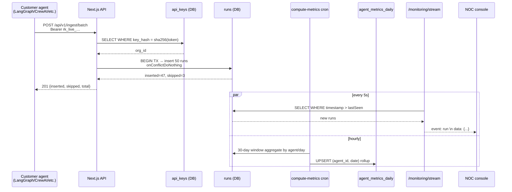

# Telemetry Engine — Technical Alignment Brief

> **For:** Client CTO + technical team alignment call
> **Subject:** How the VIPPlay Agent Telemetry engine ingests, persists, aggregates, and serves agentic-AI workflow telemetry
> **Source of truth:** `main` branch, commit `10fc398` (2026-04-22)

---

## 1. What the engine actually is

A Next.js 16 full-stack application that behaves as a **multi-tenant telemetry sink + OLAP layer** for agentic AI workflows:

- Receives run-level telemetry from customer agents via a simple REST contract (`POST /api/v1/ingest/runs` or `/batch`).
- Persists runs in PostgreSQL (RDS) using Drizzle ORM against a normalized schema (25 tables).
- Periodically rolls raw runs up into daily metrics (`agent_metrics_daily`, `process_metrics_daily`) via cron.
- Pulls external traces from Langfuse on a 15-minute cadence and merges them into the same `runs` table.
- Streams newly arrived runs to operator consoles via Server-Sent Events.
- Evaluates governance rules + statistical anomaly detection + budget caps on the rolled-up metrics, producing anomalies and audit-log entries.

**One canonical fact table (`runs`) + two materialized rollup tables drive every dashboard.**

---

## 2. Ingestion contract

### Endpoints

| Method | Path | Max payload | Purpose |
|---|---|---|---|
| `POST` | `/api/v1/ingest/runs` | 1 run | Single-run ingestion |
| `POST` | `/api/v1/ingest/batch` | 1000 runs | High-volume batch ingestion |

### Authentication

- Header: `Authorization: Bearer <raw_key>`
- Server hashes raw key with **SHA-256** (`crypto.createHash('sha256')`), looks up `api_keys.key_hash`.
- If no match → `401 Invalid API key`.
- No HMAC / request-signing today; authN is bearer-only. (See §9 risk.)

### Payload shape

```jsonc
// POST /api/v1/ingest/batch
{
  "runs": [
    {
      "runId":      "trace_abc123",      // your trace/correlation id
      "agentSlug":  "referral-triage-v2", // must match agents.slug within your org
      "timestamp":  "2026-04-22T14:33:12.450Z",
      "durationMs": 2750,
      "outcome":    true,                 // business success / failure
      "totalCost":  0.0182,               // USD, sum of inference + tool costs
      "tokenCount": 4210,
      "toolCalls":  3,
      "spans": [
        { "name": "npi_lookup", "duration_ms": 820, "status": "ok",
          "cost": 0.0, "tool_calls": 1 }
      ]
    }
  ]
}
```

### Validation (hand-rolled type guards, no Zod)

`app/api/v1/ingest/batch/route.ts:46-57` — per-field checks with path-qualified errors (`runs[3].durationMs …`). Non-negative numerics enforced; spans must be an array if present.

### Idempotency

Primary idempotency key: **(agent_id, run_id)** — backed by unique index `idx_runs_agent_run_id`. Insert uses `onConflictDoNothing()`:

```ts
await tx.insert(runs).values({...})
  .onConflictDoNothing({ target: [runs.agentId, runs.runId] })
```

Net effect: clients can safely retry the same batch — duplicates are silently skipped, response reports `{inserted, skipped, total}`.

### Transactional boundary

Entire batch wraps in `db.transaction()` (`batch/route.ts:140`). A failure mid-batch aborts all inserts in that request. Cross-request atomicity is not claimed.

### Response

```json
{ "inserted": 47, "skipped": 3, "total": 50,
  "runs": [ { "id": "uuid…", "runId": "trace_abc123" } ] }
```

---

## 3. Data model (telemetry core)

> Full schema: `lib/db/schema.ts` (25 tables). Telemetry-critical subset below.

```
organisations ──< processes ──< agents ──< agent_versions
                      │             │
                      ├──< onet_tasks (+ agent_id FK for task ownership)
                      │
                      └──< process_metrics_daily (weekly ROI rollup)

agents ──< runs (hot fact table) ──< (spans jsonb inline)
       ──< agent_metrics_daily       (daily KPI rollup)
       ──< agent_budgets             (monthly cap + alert threshold)

organisations ──< api_keys           (SHA-256 hashed bearer tokens)
              ──< anomalies          (written by detect-anomalies + check-budgets)
              ──< audit_log          (human override decisions)
              ──< governance_rules   (parsed condition DSL)
```

### Hot table: `runs`

| Column | Type | Notes |
|---|---|---|
| `id` | `uuid` PK | server-generated |
| `run_id` | `text` | client-supplied trace id |
| `agent_id` | `uuid` FK | → `agents.id` |
| `agent_version_id` | `uuid` FK | → `agent_versions.id`, nullable |
| `timestamp` | `timestamptz` | event time |
| `duration_ms` | `int` | |
| `outcome` | `bool` | business outcome |
| `total_cost` | `numeric(12,6)` | USD |
| `token_count` | `int` | |
| `tool_calls` | `int` | |
| `spans` | `jsonb` | inline — not a separate table |
| `langfuse_trace_id` | `text` | back-reference when sourced from Langfuse |
| `metadata` | `jsonb` | extensible free-form |

Indexes: `idx_runs_agent_ts (agent_id, timestamp)`, `idx_runs_ts (timestamp)`, `idx_runs_outcome (agent_id, outcome, timestamp)`, unique `idx_runs_agent_run_id (agent_id, run_id)`.

**Design note:** spans are embedded in `jsonb` rather than normalized, trading write simplicity for span-level queryability. Acceptable at today's volumes; revisit if span-level analytics become a query pattern.

### Rollup: `agent_metrics_daily`

Populated hourly by `compute-metrics` cron. One row per `(agent_id, date)`. Columns: `total_runs, successful_runs, failed_runs, latency_breaches, cost_overruns, total_cost, total_tokens, avg_duration_ms, p95_duration_ms, sigma_score, dpmo`.

### Rollup: `process_metrics_daily`

Populated hourly by `compute-process-roi` cron. One row per `(process_id, date)`. Columns for weekly ROI envelope: `agent_coverage, collaborative_coverage, human_coverage, gross_saving_weekly, net_roi_weekly, oversight_cost_weekly, inference_cost_weekly, governance_cost_weekly`.

---

## 4. End-to-end data flow

```mermaid
flowchart LR
    A[Customer agent] -- POST /runs<br/>Bearer + JSON --> B[/api/v1/ingest/batch]
    B -- SHA-256 lookup --> K[(api_keys)]
    B -- transactional<br/>onConflictDoNothing --> R[(runs)]

    LF[Langfuse API] -- pull every 15m --> S[/api/cron/sync-langfuse]
    S -- map trace → run --> R

    R --> M1[compute-metrics cron<br/>hourly]
    R --> M2[compute-process-roi cron<br/>hourly]
    M1 --> D1[(agent_metrics_daily)]
    M2 --> D2[(process_metrics_daily)]

    D1 --> ANOM[detect-anomalies cron<br/>every 6h, z-score]
    D1 --> GOV[check-governance cron<br/>hourly, rule DSL]
    R  --> BUD[check-budgets cron<br/>hourly, MTD spend]

    ANOM --> AN[(anomalies)]
    BUD  --> AN
    GOV  --> console

    R -- 5s poll --> SSE[/api/monitoring/stream<br/>Server-Sent Events]
    SSE --> UI1[Live monitoring NOC]

    D1 --> UI2[Dashboards<br/>lib/data/*.ts]
    D2 --> UI2
    AN --> UI2
```

---

## 5. Cron orchestration (EC2 crontab)

Source: `deploy/crontab`. All endpoints protected by `x-cron-secret` header matching `process.env.CRON_SECRET`.

| Cadence | Endpoint | Writes |
|---|---|---|
| `*/15 * * * *` | `/api/cron/sync-langfuse` | `runs` (pulled traces) |
| `0 * * * *` | `/api/cron/compute-metrics` | `agent_metrics_daily` |
| `5 * * * *` | `/api/cron/compute-process-roi` | `process_metrics_daily` |
| `10 * * * *` | `/api/cron/check-governance` | console (rule violations) |
| `15 * * * *` | `/api/cron/check-budgets` | `anomalies` |
| `0 */6 * * *` | `/api/cron/detect-anomalies` | `anomalies` |

> **Design tradeoff:** crons are HTTP endpoints pinned to the EC2 box via localhost. Portable, but if you horizontally scale you'll want a single scheduler (e.g. Vercel Cron, AWS EventBridge) pointing at one instance, or distributed locks in Redis.

### Key algorithms

- **Sigma score** (`compute-metrics/route.ts:12-17`) — DPMO lookup table: `≤3.4 → σ6, ≤233 → σ5, ≤6210 → σ4, ≤66807 → σ3, ≤308537 → σ2, else σ1`. Opportunities = `total_runs × 3` (failure + latency breach + cost overrun).
- **Net ROI** (`compute-process-roi/route.ts:43-125`) — `gross_saving − inference − oversight − governance`, where:
  - `gross_saving = headcount × hourly_wage × weekly_hours × (agent_cov + collab_cov)`
  - `oversight = oversightHours(avg_sigma) × hourly_wage × 1.5` (hours band: `[2,5,10,20,40]` by sigma)
  - `governance = 0.02 × gross × active_rule_count`
- **Anomaly detection** — 3σ z-score against 7-day rolling baseline of sigma, cost (critical at > 3σ, warning at > 2σ).
- **Governance rule DSL** — condition strings parsed like `"sigma < 3.5"`, `"cost > 100"`, `"failure_rate > 0.05"`, `"latency_breaches > 5"` against today's `agent_metrics_daily`.

---

## 6. Langfuse integration (pull-only, cron-driven)

`app/api/cron/sync-langfuse/route.ts` — for every org with `organisations.langfuse_host` set:

1. Read `langfuse_last_sync` (default: 24h ago).
2. `GET {host}/api/public/traces?fromTimestamp=<lastSync>` with Bearer `{decrypt(langfuse_api_key_enc)}`.
3. Map each trace → run:
   - `trace.id` → `runs.run_id` (idempotent insert on `agent_id + run_id`)
   - `trace.name` → look up `agents.slug` within org (drop if unmatched)
   - `trace.latency * 1000` → `duration_ms`
   - `trace.status !== 'ERROR'` → `outcome`
   - `trace.totalCost` / `trace.usage.totalTokens` / tool-observation count → cost/tokens/tool_calls
   - `trace.id` → `runs.langfuse_trace_id` (back-reference)
4. Update `organisations.langfuse_last_sync = now()`.

**Latency from trace to dashboard:** up to 15 min (sync) + up to 1 h (metrics rollup) = **~1h15m worst case** before rolled-up KPIs reflect Langfuse traces. Real-time SSE shows the raw runs immediately after the sync tick.

---

## 7. Real-time stream

`GET /api/monitoring/stream` — Server-Sent Events endpoint consumed by `/monitoring` (NOC dark-theme console).

- Holds `lastSeenTimestamp` in closure.
- Every 5 seconds, queries `runs WHERE timestamp > lastSeen` (limit 50), emits one `event: run` per row, advances cursor.
- Heartbeat comment on connect; keepalive comment when nothing new.
- Client disconnect handled via `request.signal.abort()`.
- **No Redis pub/sub** — simple DB polling, chosen for simplicity over fan-out efficiency. Per-connection load is a trivial query against `idx_runs_ts`. Scaling ceiling is roughly `N_viewers × (50 rows / 5s)` = small.

---

## 8. Multi-tenant isolation

All reads/writes scope by `org_id` at the SQL layer:

- Ingest auth resolves to an `api_keys.org_id`; agent-slug resolution joins `agents → processes WHERE processes.org_id = <caller org>` (`batch/route.ts:111-137`). Cross-org slug collisions are impossible.
- Dashboard queries in `lib/data/*.ts` take `orgId` as a scoping parameter throughout.
- NextAuth JWT carries `orgId` — server components read it from `getServerSession()` to scope.

Current posture: enforced in application code. **Row-Level Security (RLS) on Postgres is not enabled** — this is an audit finding but not a breach vector given single code path to the DB.

---

## 9. Security posture — short version

| Control | Current state |
|---|---|
| User passwords | PBKDF2-SHA512, 100 000 iterations, 32-byte random salt, timing-safe compare (`lib/auth.ts`) |
| User sessions | NextAuth JWT, 30-day maxAge, `role` + `orgId` embedded |
| API keys | SHA-256 hashed, `key_prefix` stored for UI display |
| Cron auth | `x-cron-secret` header (shared secret) |
| Langfuse creds | Encrypted at rest in `organisations.langfuse_api_key_enc` — cipher scheme lives in seed tooling, not the request path |
| Input validation | Hand-rolled type guards on ingest payloads; Drizzle parameterization for SQL |
| Rate limiting | **Absent** — open finding |
| Request signing (HMAC) | **Absent** — open finding |
| CORS | Defaults; no explicit allowlist |
| RLS (Postgres) | Not enabled — application-layer tenancy only |
| APM / centralized logs | **Absent** — PM2 file logs only |

---

## 10. What a typical production run looks like (sequence)



---

## 11. Recommended talking points for the call

1. **Ingestion is deliberately boring** — bearer auth, JSON POST, strict idempotency. Customers can hit it from any agent framework with a 15-line HTTP client.
2. **One fact table, two rollups** — keeps the query layer simple and lets us serve dashboards from indexed, pre-aggregated tables rather than live-scanning runs.
3. **Langfuse-compatible by design** — you can either push directly to our ingest, or continue using Langfuse and we'll pull on a 15-minute cadence. Same downstream pipeline either way.
4. **Governance + anomaly detection run on rollups**, not raw runs — cheap to scale; rules are a DSL anyone can read.
5. **Open items we'd want to close before heavier customers:** HMAC request signing, rate limiting, Postgres RLS, APM (OpenTelemetry/Datadog), distributed cron scheduling if we move past single-node.

---

## 12. File pointers (for deep-dive)

| Concern | Path |
|---|---|
| Full schema | `lib/db/schema.ts` |
| Ingest — batch | `app/api/v1/ingest/batch/route.ts` |
| Ingest — single | `app/api/v1/ingest/runs/route.ts` |
| Langfuse sync | `app/api/cron/sync-langfuse/route.ts` |
| Metric rollup | `app/api/cron/compute-metrics/route.ts` |
| ROI rollup | `app/api/cron/compute-process-roi/route.ts` |
| Anomaly detect | `app/api/cron/detect-anomalies/route.ts` |
| Governance | `app/api/cron/check-governance/route.ts` |
| Budgets | `app/api/cron/check-budgets/route.ts` |
| SSE stream | `app/api/monitoring/stream/route.ts` |
| Auth | `lib/auth.ts` |
| Data access | `lib/data/{runs,sigma,processes,analytics}.ts` |
| Cron wiring | `deploy/crontab` |
| PM2 / EC2 | `ecosystem.config.js`, `deploy/setup.sh` |
