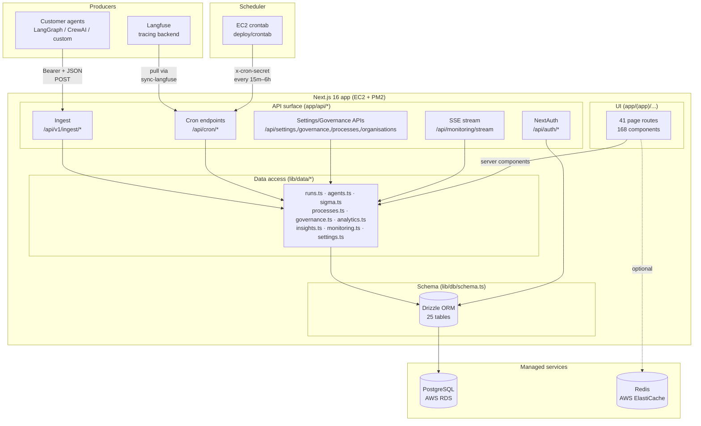
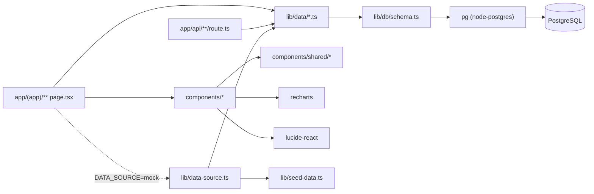
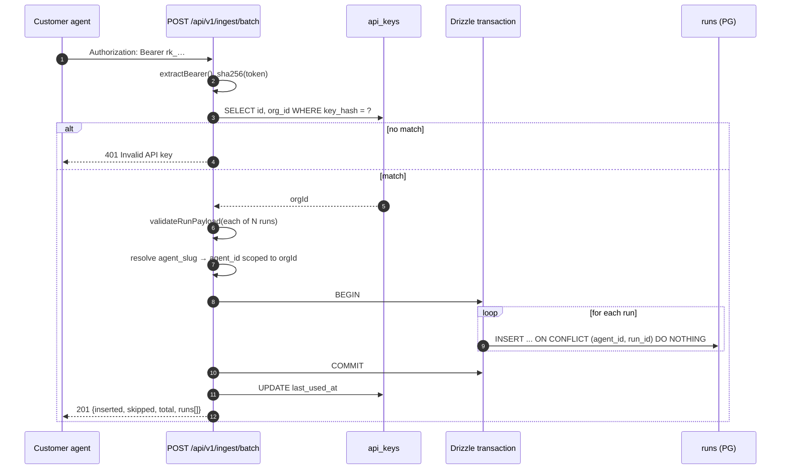
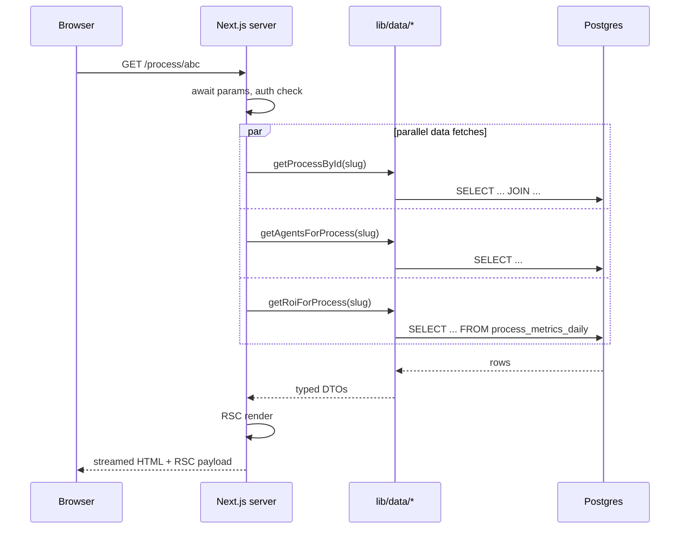
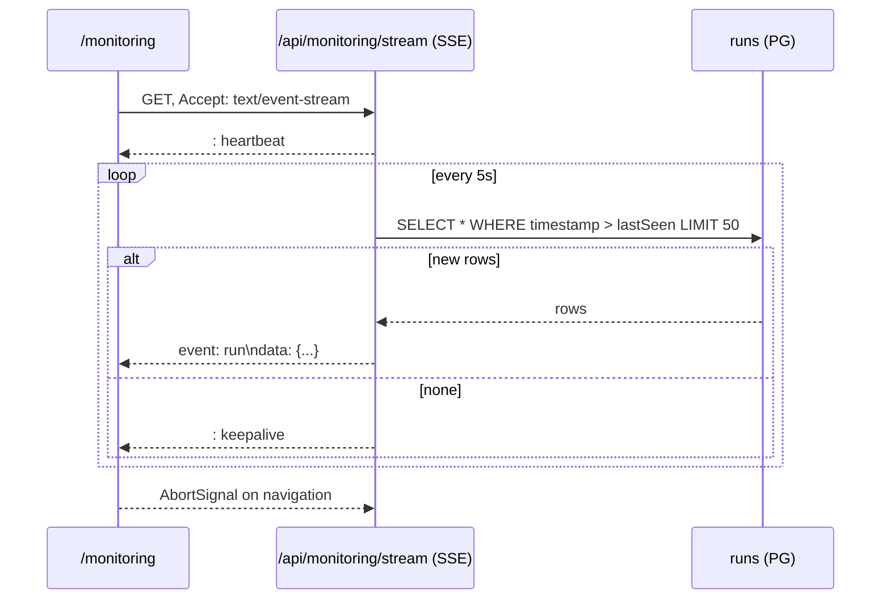

# 02 — System Architecture

## Logical view

## Two-tier layout

The UI tree has a deliberate split:

- `app/layout.tsx` — root layout: fonts, metadata (`r-Potential` title template), `<OrganisationProvider>` → `<LanguageModeProvider>`, Sonner toaster. Wraps everything.
- `app/(app)/layout.tsx` — **client-component** shell for authenticated surfaces: Sidebar (fixed 260 px), TopBar (breadcrumbs + ⌘K search + notifications), command palette. Any route added under `app/(app)/` inherits the shell automatically.
- `app/login/page.tsx` and the root redirect `app/page.tsx` live **outside** the `(app)` group — no sidebar/topbar.

## Module dependencies

`lib/data-source.ts` is the migration seam: pages that haven't been cut over yet import from it and get mock constants; pages on the DB path import from `lib/data/*` directly.

## Request lifecycle — ingestion

## Request lifecycle — page render

## Real-time stream

## Concurrency & scaling properties

| Concern | Current design | Notes |
|---|---|---|
| Ingest writes | Single-node Postgres via `pg` pool | Pool sized by `pg` defaults; each batch wraps in one TX |
| Idempotency | `onConflictDoNothing` on `(agent_id, run_id)` unique index | Safe retry semantics out of the box |
| Cron fan-out | One EC2 node's `crontab` hits `localhost:3000` | Single-node; distributed deployment will need a single scheduler or Redis locks |
| Dashboards | Read from `*_metrics_daily` rollups, not raw `runs` | Index-backed single-row-per-day reads |
| SSE | DB polling per viewer (5 s, limit 50) | Viable for small operator teams; if we move to 100s of viewers, switch to Redis pub/sub fan-out |
| Tenant isolation | Enforced by app code (`org_id` scope in every query) | RLS on Postgres is an open recommendation |

## Notes on Next.js 16 specifics in use

- All request APIs are awaited: `await params`, `await searchParams`, `await cookies()`, `await headers()`.
- No `middleware.ts` — when middleware is introduced, use `proxy.ts` (Node.js runtime only) per Next.js 16.
- Turbopack is the default dev + build bundler; config is top-level in `next.config.ts` (not under `experimental`).
