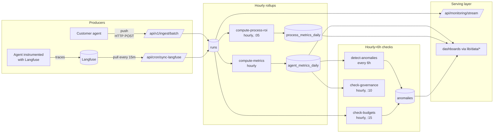
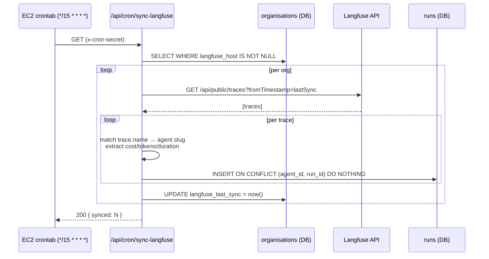

# 05 — Data Flow & Event Processing

## The canonical data path



## Key processing rules

### Run insert (ingest path)

1. Auth — sha256(bearer) lookup in `api_keys` → `org_id`.
2. Per-run validation — type guards in `validateRunPayload()`.
3. Agent resolution — unique slugs collected, joined `agents × processes` scoped to `org_id`. Missing slug → 400.
4. Transactional insert — `db.transaction()` wraps all rows; `onConflictDoNothing({agent_id, run_id})`.
5. `api_keys.last_used_at ← now()`.

### Hourly rollup — `agent_metrics_daily`

For each agent active in the last 24h:

```
window          = last 30 days of runs
total_runs      = count(*)
successful      = count(outcome = true)
failed          = total_runs − successful
latency_breach  = count(duration_ms > 5000)
cost_overrun    = count(total_cost > 0.10)
avg_duration    = avg(duration_ms)
p95_duration    = sorted[⌈0.95·n⌉]
total_cost      = sum(total_cost)
total_tokens    = sum(token_count)

DPMO            = (failed + latency_breach + cost_overrun) / (total_runs × 3) × 10^6
sigma_score     = DPMO bucketed:
                    ≤ 3.4      → 6σ
                    ≤ 233      → 5σ
                    ≤ 6 210    → 4σ
                    ≤ 66 807   → 3σ
                    ≤ 308 537  → 2σ
                    else       → 1σ
```

Upsert keyed on `(agent_id, date)`.

### Hourly rollup — `process_metrics_daily`

Per process (using the last 7 days of runs for the weekly envelope):

```
gross_saving    = headcount × avg_hourly_wage × weekly_hours
                  × (agent_coverage + collaborative_coverage)
inference_cost  = sum(runs.total_cost over 7d)
avg_sigma       = mean(agent_metrics_daily.sigma_score across process agents)
oversight_hours = band(avg_sigma) ∈ [2, 5, 10, 20, 40]
oversight_cost  = oversight_hours × avg_hourly_wage × 1.5
governance_cost = 0.02 × gross_saving × active_rule_count
net_roi         = gross_saving − inference − oversight − governance
```

Upsert keyed on `(process_id, date)`.

### Anomaly detection (every 6 h)

For each agent, compare today's metric to the **7-day rolling baseline**:

```
baseline_mean    = mean(last 7 days, excluding today)
baseline_stddev  = stddev(last 7 days, excluding today)
z                = |today − baseline_mean| / baseline_stddev

z > 3  → severity = 'critical'
z > 2  → severity = 'warning'
```

Metrics checked: `sigma_score`, `total_cost`. Writes a row per violation to `anomalies (org_id, agent_id, timestamp, severity, category, description, metadata, acknowledged=false)`.

### Budget check (hourly)

```
mtd_spend = sum(runs.total_cost WHERE timestamp >= start_of_month)
if mtd_spend > monthly_cap:                          → 'critical'
elif mtd_spend > monthly_cap × alert_threshold/100:  → 'warning'
```

### Governance rule DSL

Condition strings such as:

- `"sigma < 3.5"`
- `"cost > 100"`
- `"failure_rate > 0.05"`
- `"latency_breaches > 5"`

Parsed in `check-governance/route.ts:24-74` and evaluated against today's `agent_metrics_daily`. **Violations currently log to console and are not persisted** — flagged as technical debt in §10.

## Langfuse sync loop



**End-to-end latency (Langfuse trace → rolled-up KPI):**

```
0–15 min  : next sync tick
0–60 min  : next metric rollup tick
────────────────────────────
~0–75 min : worst case
```

Real-time SSE shows the raw `runs` rows immediately after the sync inserts them — so operators see new runs within 15 minutes regardless of the rollup cadence.

## State machines

### Run lifecycle

```
(client request)
      │
      ▼
 validated ── fail ──► 400/401 response (not persisted)
      │
   (ok)
      ▼
 inserted ── duplicate ──► skipped (idempotency hit)
      │
   (new)
      ▼
 live in runs ──► swept into agent_metrics_daily (hourly)
                 swept into process_metrics_daily (hourly, :05)
                 checked for governance (hourly, :10)
                 checked for budget (hourly, :15)
                 checked for anomaly (every 6h)
```

### Anomaly lifecycle

```
 generated (severity=warning|critical, acknowledged=false)
        │
        ├─► surfaced on /dashboard (AttentionRequired component)
        │
        ▼
   acknowledged=true (via UI) — remains in table for audit
```

## Data retention

- `runs`: indefinite today; a retention policy (e.g. 180-day cold archive) is an open recommendation as cardinality grows.
- `agent_metrics_daily` / `process_metrics_daily`: indefinite — small, one row per day per entity.
- `anomalies`: indefinite — small.
- `audit_log`: indefinite — required for governance evidence.
