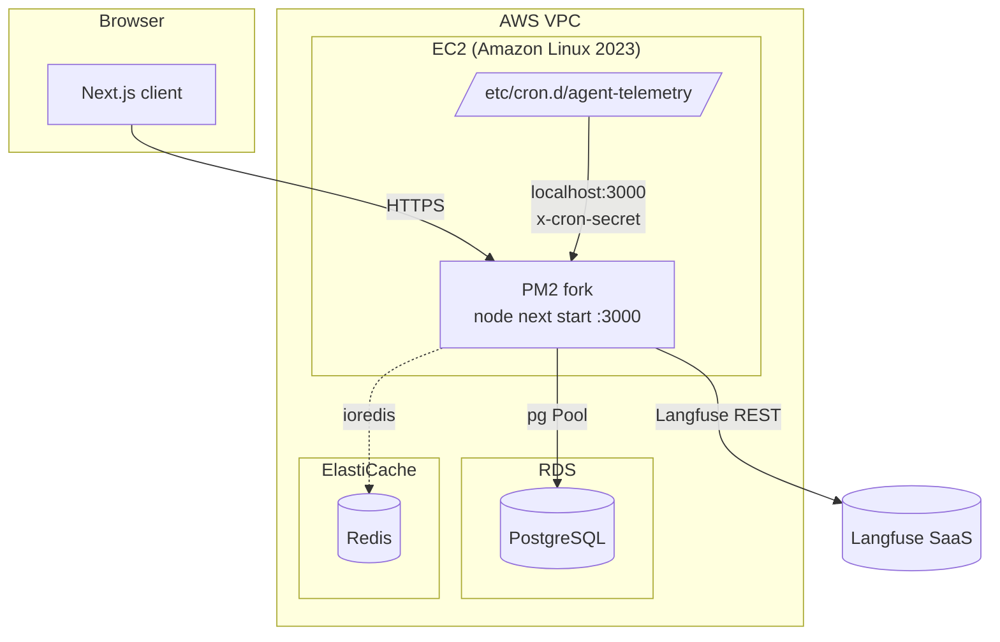
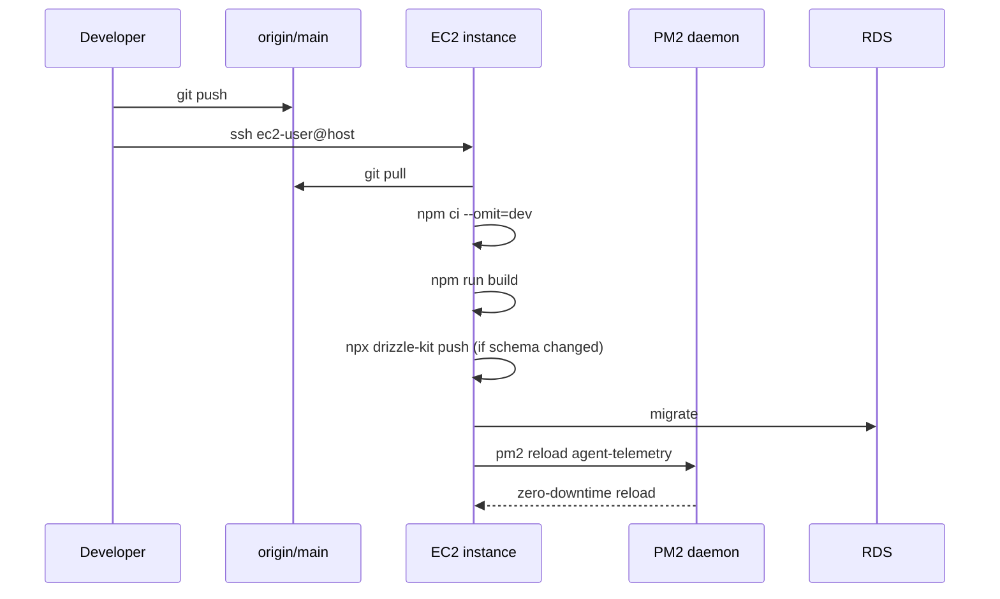

# 06 — Deployment & Infrastructure

## Target environment

```
AWS (single-region)
├─ EC2 instance (Amazon Linux 2023, Node 22 via nvm)
│   ├─ PM2 managed process: `next start` on :3000
│   ├─ systemd — `pm2 startup` for boot resume
│   └─ crontab — /etc/cron.d/agent-telemetry (HTTPs cron triggers)
├─ RDS — PostgreSQL (single primary, snapshots)
└─ ElastiCache — Redis (ioredis client; used as pub/sub seam — currently unused in serving path)
```

No Dockerfile, no docker-compose, no Kubernetes manifests. Vercel project metadata is present (`.vercel/project.json`) as a historical artefact but the active deployment is EC2.

## Infrastructure diagram



## Bootstrap (`deploy/setup.sh`)

```bash
# installs Node 22 via nvm
# installs PM2 globally
# ensures /var/log/agent-telemetry exists
# copies deploy/crontab → /etc/cron.d/agent-telemetry
# npm ci --omit=dev && npm run build
# pm2 start ecosystem.config.js
# pm2 save && pm2 startup (systemd hook)
```

## PM2 (`ecosystem.config.js`)

```js
{
  apps: [{
    name: 'agent-telemetry',
    script: 'npm',
    args:   'run start',
    cwd:    '/opt/agent-telemetry',
    instances: 1,
    exec_mode: 'fork',
    env_production: { NODE_ENV: 'production', PORT: '3000' },
    error_file: '/var/log/agent-telemetry/error.log',
    out_file:   '/var/log/agent-telemetry/out.log',
    max_memory_restart: '1G',
  }],
}
```

Runs as `ec2-user`. Env loaded from `.env.production` (PM2 native env support).

## Crontab (`deploy/crontab`)

```cron
SHELL=/bin/bash
CRON_SECRET=<set-in-env>

*/15 * * * *  ec2-user  curl -sf -H "x-cron-secret: $CRON_SECRET" \
              http://localhost:3000/api/cron/sync-langfuse    >> /var/log/agent-telemetry/cron.log 2>&1
0   * * * *   ec2-user  curl ... /api/cron/compute-metrics
5   * * * *   ec2-user  curl ... /api/cron/compute-process-roi
10  * * * *   ec2-user  curl ... /api/cron/check-governance
15  * * * *   ec2-user  curl ... /api/cron/check-budgets
0 */6 * * *   ec2-user  curl ... /api/cron/detect-anomalies
```

## Environment variables

| Variable | Loaded from | Used by | Required |
|---|---|---|---|
| `DATABASE_URL` | `.env.production` | `lib/db/index.ts`, `drizzle.config.ts`, `scripts/seed.ts` | ✅ |
| `NEXTAUTH_URL` | `.env.production` | NextAuth callback URLs | ✅ |
| `NEXTAUTH_SECRET` | `.env.production` | JWT signing | ✅ |
| `CRON_SECRET` | `.env.production` + `/etc/cron.d` | All cron endpoints | ✅ |
| `REDIS_URL` | `.env.production` | `ioredis` initialisation | ✅ (if Redis features enabled) |
| `DATA_SOURCE` | `.env.production` | `lib/data-source.ts` bridge | optional; `mock` or `db` |

Langfuse credentials are **not** environment variables — they live encrypted per-org in `organisations.langfuse_api_key_enc`.

## Deployment flow



> Today this is manual. Automating via GitHub Actions → SSH + `pm2 reload` is a low-lift next step; a move to Vercel (zero-config for Next.js 16) would also be straightforward given the architecture.

## Backup & recovery

- **RDS automated snapshots** — managed by AWS; retention per account settings.
- **App state** — stateless; only `/var/log/agent-telemetry/*` on disk (rebuild-friendly).
- **Crontab** — versioned in `deploy/crontab`; reinstall via `setup.sh`.
- **Secrets** — `.env.production` is the single source of runtime secrets on the instance. Rotation is manual today.

## Deployment characteristics

| Property | Value |
|---|---|
| Cold start | ~3–6 s (PM2 fork; Next.js standalone) |
| Horizontal scaling | Not yet — single-node today |
| Zero-downtime deploy | `pm2 reload` (fork-mode graceful swap) |
| Database migrations | `npx drizzle-kit push` — requires DBA sign-off (no `drizzle-kit migrate` files yet) |
| Config reload | Requires `pm2 reload` (env vars read at process start) |

## Open infrastructure recommendations

1. Commit explicit migration files (`drizzle-kit generate`) instead of `push` against prod.
2. Introduce a distributed scheduler (Vercel Cron, EventBridge, or Redis-backed locks) before going multi-node.
3. Add CloudWatch agent + structured log shipping — today's `/var/log/agent-telemetry/*.log` is file-only.
4. Add RDS Performance Insights + `pg_stat_statements` — today there is no query-profile feedback loop.
