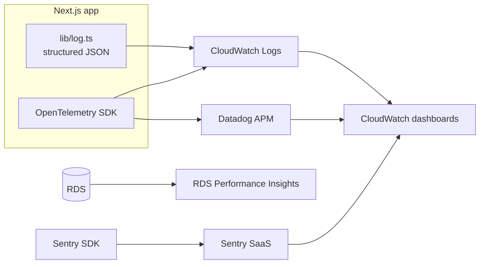

# 09 — Observability & Debugging

## What we observe today

| Concern | Mechanism | Where it lives |
|---|---|---|
| App logs (stdout/stderr) | PM2 file capture | `/var/log/agent-telemetry/{out,error}.log` |
| Cron execution logs | crontab `>> /var/log/agent-telemetry/cron.log` | `/var/log/agent-telemetry/cron.log` |
| Audit events (human decisions) | `audit_log` table | Postgres |
| Anomaly events | `anomalies` table | Postgres |
| API key usage | `api_keys.last_used_at` | Postgres |
| Schema-level query timing | Not instrumented today | — |
| RUM / Core Web Vitals | Not instrumented today | — |
| Error tracking (Sentry/Datadog) | Not integrated today | — |

## Observability gaps (prioritised)

1. **No APM / tracing.** The system that tells you how your agents perform has no tracing on itself. Add OpenTelemetry SDK + Vercel OTEL or Datadog APM.
2. **No structured logs.** `console.error('[cron/check-budgets] Error:', err)` is text, not JSON. Adopt a minimal `lib/log.ts` that emits `{ ts, level, event, ctx }` JSON — log shipping (CloudWatch / Loki) becomes trivial.
3. **No error tracking.** Sentry or Rollbar on both server and client to catch unhandled rejections and React errors.
4. **No Core Web Vitals.** Next.js exposes `reportWebVitals` — wire to Vercel Analytics or a self-hosted collector.
5. **No DB telemetry.** Enable `pg_stat_statements` on RDS; stream to CloudWatch Performance Insights.

## Today's debugging playbook

### "Runs aren't showing up in the dashboard"

1. `curl` the ingest endpoint with a known-good payload and a valid bearer — does it 201?
   ```bash
   curl -X POST https://<host>/api/v1/ingest/runs \
     -H "Authorization: Bearer rk_live_xxx" \
     -H "Content-Type: application/json" \
     -d '{"runId":"debug-1","agentSlug":"<slug>","timestamp":"2026-04-22T00:00:00Z",
          "durationMs":100,"outcome":true,"totalCost":0.01,"tokenCount":100,"toolCalls":0}'
   ```
2. Query `runs` directly — `SELECT * FROM runs WHERE run_id = 'debug-1'`.
3. Check the rollup — `SELECT * FROM agent_metrics_daily WHERE agent_id = ? AND date = current_date`. If the run landed but there's no metric, trigger the cron manually: `curl -H "x-cron-secret: $CRON_SECRET" http://localhost:3000/api/cron/compute-metrics`.

### "Langfuse sync isn't picking anything up"

1. `SELECT langfuse_host, langfuse_last_sync FROM organisations WHERE id = ?` — is the host set and `last_sync` sensible?
2. Trigger manually: `curl -H "x-cron-secret: $CRON_SECRET" http://localhost:3000/api/cron/sync-langfuse`.
3. Inspect `/var/log/agent-telemetry/cron.log` for response.
4. Verify trace names in Langfuse match an `agents.slug` in the target org. Unmatched traces are silently dropped.

### "The /monitoring page shows stale data"

1. Confirm the SSE stream is open: browser DevTools → Network → filter EventStream.
2. `tail -f /var/log/agent-telemetry/out.log` during the session.
3. The endpoint polls every 5 s — if you see heartbeats but no `event: run`, the query itself returned 0 new rows.

### "A cron appears not to have fired"

1. `cat /var/log/agent-telemetry/cron.log | tail -50` — confirms curl invocation and HTTP status.
2. Check system cron: `sudo systemctl status cron`.
3. Check secret mismatch — cron returns 401 loudly in the log if `CRON_SECRET` drifted between `.env.production` and `/etc/cron.d/agent-telemetry`.

## What a production run looks like on the wire

```
# ingest
[2026-04-22T14:33:12Z] POST /api/v1/ingest/batch — 201 — 47 inserted, 3 skipped, 120 ms

# 15 minutes later — sync-langfuse cron (if Langfuse is configured)
[2026-04-22T14:45:00Z] GET /api/cron/sync-langfuse — 200 — 12 traces synced, 450 ms

# next top of the hour — metric rollups
[2026-04-22T15:00:00Z] GET /api/cron/compute-metrics — 200 — 8 agents updated, 870 ms
[2026-04-22T15:05:00Z] GET /api/cron/compute-process-roi — 200 — 4 processes updated, 340 ms
[2026-04-22T15:10:00Z] GET /api/cron/check-governance — 200 — 17 rules evaluated, 0 violations, 210 ms
[2026-04-22T15:15:00Z] GET /api/cron/check-budgets — 200 — 22 budgets checked, 1 anomaly, 180 ms
```

## Proposed observability architecture (near-term)



## Health-check endpoint (recommended)

Add `GET /api/healthz` that:

1. Runs `SELECT 1` against `runs` table (DB reachability).
2. Pings Redis (if enabled) via `ioredis.ping()`.
3. Reports `{ status: 'ok', commit: <sha>, uptimeMs }` in < 100 ms.

This gives ALB / external monitors a simple probe and decouples liveness from any specific page route.
