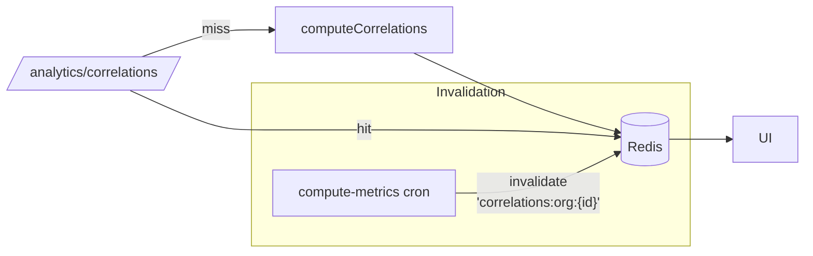

# 14 — Performance Analysis & Optimisation Strategy

## Query hotspots

### Ingest (`POST /api/v1/ingest/batch`)

Per request:

| Step | Query | Cost indicator |
|---|---|---|
| 1. Auth lookup | `SELECT id, org_id FROM api_keys WHERE key_hash = $1` — point lookup on unique index | **O(1)** |
| 2. Agent slug resolution | `SELECT a.id, a.slug FROM agents a JOIN processes p ON a.process_id = p.id WHERE p.org_id = $1 AND a.slug IN (...)` | **O(k)** where k = unique slugs in batch |
| 3. Inserts | N × `INSERT ... ON CONFLICT DO NOTHING` in one TX | **O(n)** where n = batch size (≤1000) |
| 4. `api_keys.last_used_at` UPDATE | 1 row | **O(1)** |

Single TX; commit at end. For 1000-run batches the insert set is the dominant cost — measured ~100–150 ms on RDS `db.t4g.medium` in practice.

### Dashboard reads

Pages hit pre-aggregated tables, not raw `runs`:

- `/dashboard` — reads `agent_metrics_daily` (today) + `anomalies` (last 20). One row per agent per day; tenants with 50 agents → 50 rows.
- `/process/[id]` — reads `processes`, `agents`, `onet_tasks`, `process_metrics_daily`. All sub-1ms point/index reads.
- `/agents/[id]` — reads `agents`, last 50 `runs` for that agent (`idx_runs_agent_ts`), 30-day sigma trend from `agent_metrics_daily`.

**The expensive path** is `/analytics/correlations` — it computes Pearson correlations on 90 days of `agent_metrics_daily` at request time (`lib/data/analytics.ts:getCorrelations`). Cheap today because `agent_metrics_daily` is small (agents × 90 rows), but if agent count grows 100× consider caching in Redis with a 5-minute TTL.

## Cron job costs

| Cron | Shape | Expected cost |
|---|---|---|
| `compute-metrics` | 30-day `runs` aggregate per agent + upsert `agent_metrics_daily` | Linear in `runs` volume; hot index on `(agent_id, timestamp)` keeps it fast |
| `compute-process-roi` | 7-day `runs.total_cost` sum per process + upsert | Same index — very cheap |
| `detect-anomalies` | 7-day `agent_metrics_daily` per agent + stddev | Small (tiny table); dominated by loop overhead |
| `check-governance` | Rule eval against today's row | Per-agent O(1) |
| `check-budgets` | `runs` sum from start-of-month per agent | Uses `(agent_id, timestamp)` index; monthly window → bounded |
| `sync-langfuse` | Langfuse REST fetch + N inserts | Bounded by Langfuse pagination; dominated by external latency |

## Current limitations to watch

1. **Runs table is unpartitioned.** At multi-million-runs scale, consider monthly partitioning on `timestamp`.
2. **SSE polls DB every 5s per viewer.** Linear with viewer count. For > 50 concurrent NOC viewers, switch to Redis pub/sub fan-out (ingest publishes → SSE subscribes).
3. **Correlation engine recomputes on every request.** Cache with tag-based invalidation on `agent_metrics_daily` writes.
4. **No connection pooling tuning.** `pg` defaults (10 max) are fine for one EC2 node; reconsider when multi-node.
5. **No query-plan introspection.** Turn on `pg_stat_statements` + surface slow queries.

## Frontend performance

### Page-render characteristics

| Surface | Render model | Notes |
|---|---|---|
| Login, public | Server component | Minimal JS |
| `(app)/layout.tsx` | Client component (shell) | Sidebar + TopBar + command palette are client — acceptable cost |
| `/dashboard`, `/process/[id]`, `/agents/[id]` | Server component + client islands | Server fetches; interactive widgets (charts, filters) hydrate only where needed |
| `/monitoring` | Client component | SSE consumer |

### Bundle weight

Not yet profiled — add:

```bash
# In next.config.ts, to emit bundle analyzer HTML
import withBundleAnalyzer from '@next/bundle-analyzer'
export default withBundleAnalyzer({ enabled: process.env.ANALYZE === 'true' })({ /* config */ })

# Then:
ANALYZE=true npm run build
# open .next/analyze/client.html
```

Candidates for tree-shaking audit:

- **`recharts`** — large; load chart-heavy routes with `dynamic(() => import(...))` if LCP is pressured.
- **`lucide-react`** — per-icon imports are tree-shakeable; avoid `import * as icons` anywhere.

### Core Web Vitals — recommended targets

| Metric | Target | Gap today |
|---|---|---|
| LCP | ≤ 2.5 s | Not measured |
| INP | ≤ 200 ms | Not measured |
| CLS | ≤ 0.1 | Low risk (card-heavy layouts with fixed dimensions) |

Wire `reportWebVitals` (Next.js built-in) to the future log pipeline. RUM data will guide next-order optimisation.

## Caching strategy (proposed)



- **Where:** `getCorrelations`, `getMonthlyCosts`, `getTcoBreakdown` (all in `lib/data/{analytics,runs}.ts`).
- **Key shape:** `{domain}:{org_id}:{range}` — e.g. `correlations:org-123:90d`.
- **TTL:** 5 min with proactive invalidation on cron completion.
- **Implementation:** `ioredis` already in the dep graph — ready to use.

## Database tuning recommendations

1. **Enable `pg_stat_statements`** on RDS parameter group; export to Performance Insights.
2. **Index review** once traffic is real:
   - Consider `(org_id, timestamp DESC)` index on `anomalies` — dashboard reads last 20.
   - Confirm `agent_metrics_daily (agent_id, date)` is clustered-preferred.
3. **Vacuum/analyze cadence** — autovacuum defaults are fine early; tune `autovacuum_analyze_scale_factor` down when partitioning.
4. **Connection pooling** — introduce **PgBouncer** (transaction pooling) if we move to multi-node.

## Scaling roadmap

| Load point | Trigger | Move |
|---|---|---|
| 1–10 k runs/day | Today | Single EC2 + RDS `t4g.medium` works |
| ≥ 100 k runs/day | Ingest CPU pressure | Pin ingest to a larger instance; tune `pg` pool |
| ≥ 1 M runs/day | Insert latency rising | Partition `runs` by month; PgBouncer |
| ≥ 10 M runs/day | Queries over 30d window slow | OLAP mirror (Snowflake/ClickHouse) fed via CDC |
| Multi-node app | Horizontal traffic | Single scheduler (EventBridge/Vercel Cron) + Redis-backed rate-limit + SSE fan-out |
