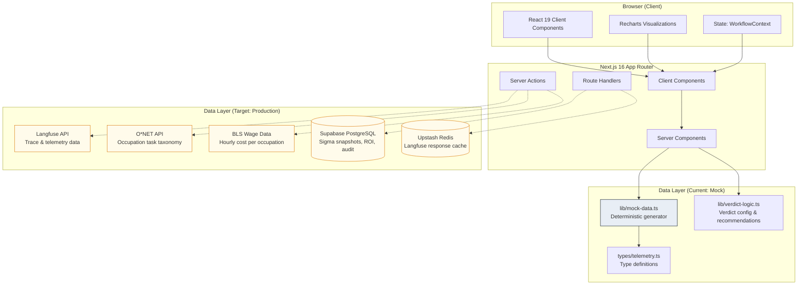
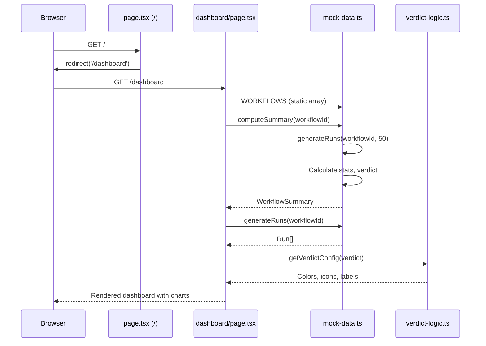
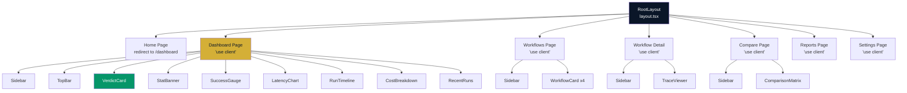
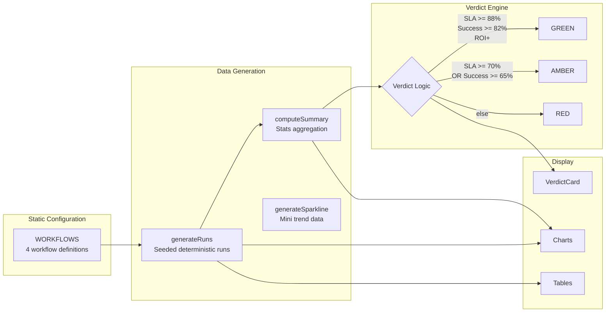

# 2. System Architecture

## High-Level Architecture



> Dashed lines (-.->`) indicate planned integrations not yet implemented.

## Application Flow



## Component Tree



## Data Flow Architecture



## Rendering Strategy

| Route | Strategy | Reason |
|---|---|---|
| `/` | Server Component | Simple redirect, no client state |
| `/dashboard` | Client Component (`'use client'`) | Workflow selector state, chart interactivity |
| `/workflows` | Client Component | Sidebar navigation state |
| `/workflows/[id]` | Client Component | Dynamic params, trace viewer interactivity |
| `/compare` | Client Component | Multi-workflow selection state |
| `/reports` | Client Component | Report configuration state |
| `/settings` | Client Component | Form state management |

> **Note**: The current implementation makes most pages client components. In production, consider moving data fetching to Server Components and pushing `'use client'` boundaries down to individual interactive widgets.

## Layout Structure

```
+------------------+----------------------------------------+
|                  |          TopBar (workflow selector)      |
|    Sidebar       +----------------------------------------+
|    (240px)       |                                        |
|    Fixed left    |          Main Content Area              |
|                  |          (p-6, flex-col, gap-6)         |
|    - MONITOR     |                                        |
|    - ANALYZE     |          VerdictCard                    |
|    - CONFIGURE   |          StatBanner                     |
|                  |          [SuccessGauge] [LatencyChart]  |
|                  |          [RunTimeline] [CostBreakdown]  |
|                  |          RecentRuns table               |
|                  |                                        |
+------------------+----------------------------------------+
```

---

*Diagrams use Mermaid.js syntax. Render in any Mermaid-compatible viewer.*
