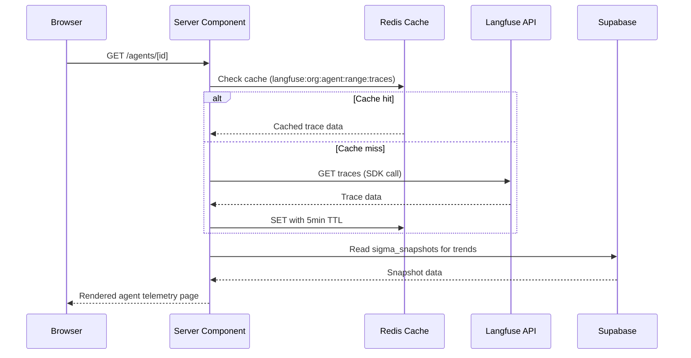
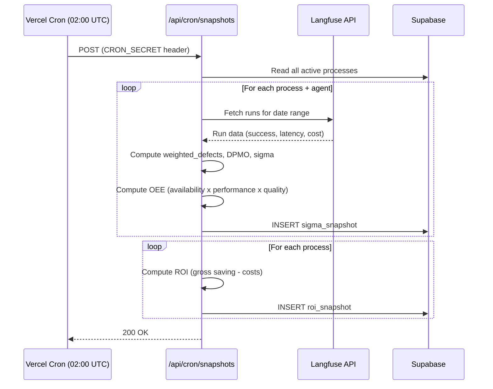

# 4. API Documentation

## Current State

The application currently has **no API routes** — all data is generated client-side via `lib/mock-data.ts`. This document describes both the current internal data contracts and the planned API architecture from the technical specification.

---

## Internal Data Contracts (Current)

### Mock Data Functions

#### `generateRuns(workflowId: string, count?: number): Run[]`

Generates a deterministic array of workflow runs.

- **Parameters**:
  - `workflowId` — Workflow identifier (matches `WORKFLOWS[].id`)
  - `count` — Number of runs to generate (default: 50)
- **Returns**: Array of `Run` objects with spans
- **Determinism**: Uses `workflowId.length * 137` as seed base, `(seed + i * 31337) % 1000` per run
- **Run Distribution**:
  - `s < 720` → fast tier (800-1600ms)
  - `s < 870` → slow tier (3200-5200ms)
  - `s >= 870` → failed tier (1200-2600ms, outcome: false)
- **Token Cost Rates**:
  - `gpt-4o`: $0.000015/token
  - `gpt-4o-mini`: $0.000003/token
  - `claude-3-5-sonnet`: $0.000012/token

#### `computeSummary(workflowId: string): WorkflowSummary`

Computes aggregate statistics and verdict for a workflow.

- **Parameters**: `workflowId` — Workflow identifier
- **Returns**: `WorkflowSummary` with all computed fields
- **Verdict Logic**:
  ```
  if (slaHitRate >= 0.88 && successRate >= 0.82 && roiPositive) → GREEN
  else if (slaHitRate >= 0.70 || successRate >= 0.65) → AMBER
  else → RED
  ```
- **Consistency Score**: `max(0, min(100, round(100 * (1 - coefficientOfVariation))))`

#### `generateSparkline(workflowId: string, count?: number): { value: number }[]`

Generates mini trend data for sparkline charts.

- **Parameters**: `workflowId`, `count` (default: 7)
- **Returns**: Array of `{ value: duration_ms }` points

### Workflow Definitions

```typescript
const WORKFLOWS = [
  {
    id: "odds-analysis-agent",
    name: "Odds Analysis Agent",
    agents: ["OddsScraperAgent", "LineComparisonAgent", "RecommendationWriterAgent"],
    framework: "CrewAI", model: "gpt-4o",
    sla_ms: 3500, value_per_success: 45.00
  },
  {
    id: "player-engagement-agent",
    name: "Player Engagement Agent",
    agents: ["PlayerProfilerAgent", "OfferGeneratorAgent", "CopyWriterAgent"],
    framework: "CrewAI", model: "claude-3-5-sonnet",
    sla_ms: 2800, value_per_success: 32.00
  },
  {
    id: "content-moderation-agent",
    name: "Content Moderation Agent",
    agents: ["ContentExtractorAgent", "ComplianceCheckerAgent", "FlagDecisionAgent"],
    framework: "CrewAI", model: "gpt-4o-mini",
    sla_ms: 1500, value_per_success: 12.00
  },
  {
    id: "vip-support-agent",
    name: "VIP Customer Support Agent",
    agents: ["IntentClassifierAgent", "KnowledgeRetrieverAgent", "ResponseDraftAgent"],
    framework: "CrewAI", model: "claude-3-5-sonnet",
    sla_ms: 4000, value_per_success: 68.00
  }
]
```

---

## Planned API Architecture (Target State)

### Server Actions

| Action | Input | Side Effect |
|---|---|---|
| `saveOrganisationSetup()` | `OrgSetupSchema` | Upserts `organisations` row, validates O*NET credentials |
| `selectOccupation()` | `{ onet_code, process_name, headcount }` | Creates `processes` row, fetches/caches `onet_tasks` |
| `saveCoverageMap()` | `CoverageMapSchema[]` | Upserts `coverage_map` rows, clears sigma cache |
| `logAuditDecision()` | `AuditLogSchema` | INSERT ONLY to `audit_log` (immutable) |
| `updateLanguageMode()` | `{ mode: 'operations' \| 'quality' }` | Updates `users.language_mode` |
| `triggerExport()` | `ExportConfigSchema` | Generates PDF/PPTX, returns signed URL |

### Route Handlers

| Route | Method | Purpose |
|---|---|---|
| `/api/cron/snapshots` | POST | Vercel cron target. Computes nightly sigma + ROI snapshots from Langfuse. Auth: `CRON_SECRET` |
| `/api/onet/search` | GET | Proxies O*NET occupation search. Params: `?q={keyword}` |
| `/api/langfuse/traces/[agent]` | GET | Paginated trace list for an agent. Redis-cached (5min TTL) |
| `/api/audit/export` | POST | Generates EU AI Act audit log PDF. Body: `{ process_id, date_range }` |

### External API Integrations

#### Langfuse API
- **Purpose**: Trace & telemetry data source
- **Authentication**: Public key + secret key (per-org)
- **Cache Strategy**: Upstash Redis, 5-minute TTL
- **Cache Key Pattern**: `langfuse:{org_id}:{agent_name}:{date_range}:{metric_type}`
- **SDK**: `langfuse` Node SDK v3.x

#### O*NET Web Services REST API
- **Base URL**: `https://services.onetcenter.org/ws/`
- **Authentication**: Registered username (free account)
- **Cache Strategy**: Next.js `revalidate: 604800` (7 days) + local `onet_tasks` table
- **Key Endpoints**:
  - `GET /occupations/{code}/tasks` — Task list with importance and frequency
  - `GET /occupations/search?keyword={q}` — Occupation search
  - `GET /occupations/{code}/related_activities` — Work activity categories

#### BLS Wage Data
- **Purpose**: Hourly wage rates per occupation for ROI calculations
- **Integration**: Lookup by O*NET SOC code, fallback to manual `avg_hourly_wage_usd` override

### Sequence Diagram: Planned Langfuse Integration



### Sequence Diagram: Nightly Sigma Computation


