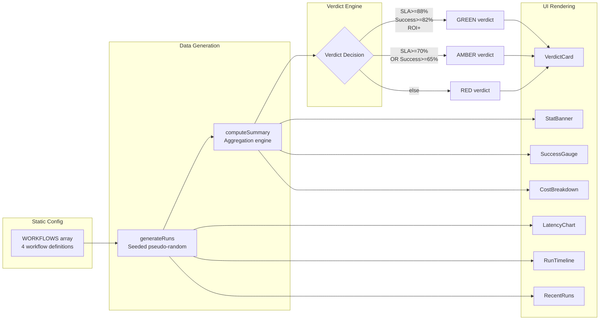
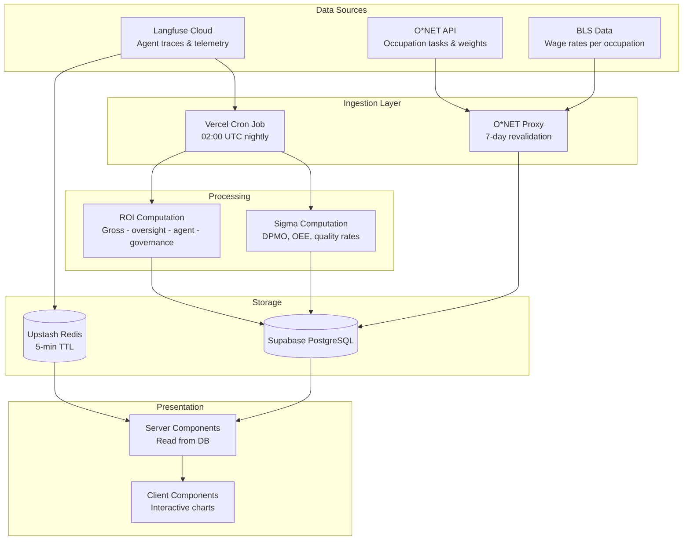
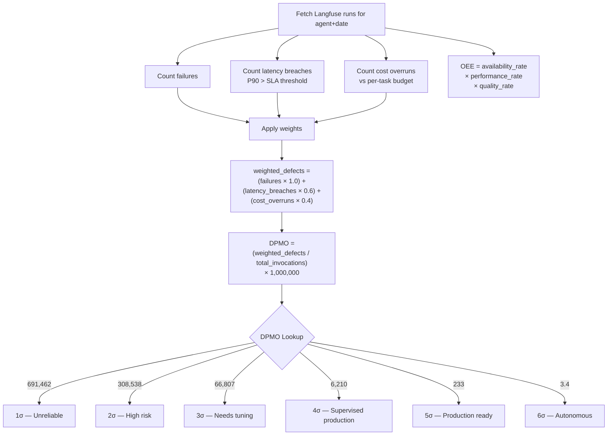
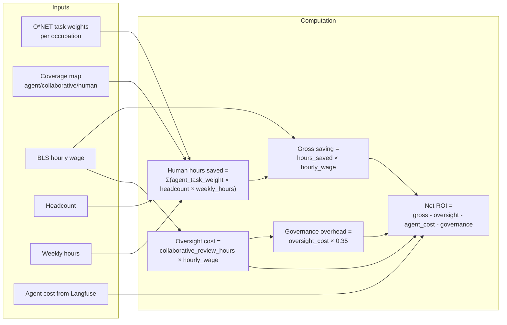
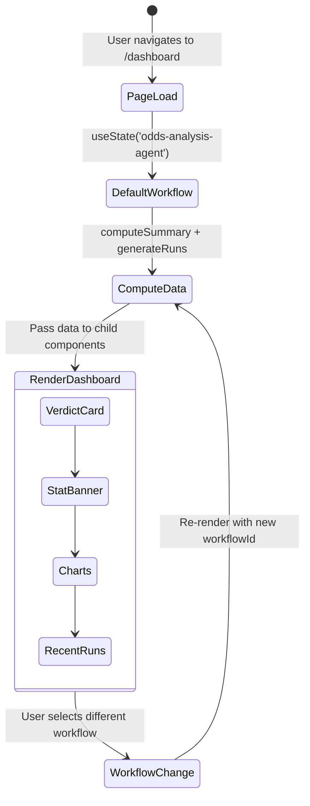

# 5. Data Flow & Event Processing

## Current Data Flow (Mock)



## Run Generation Pipeline

The mock data pipeline is deterministic — given the same `workflowId`, it always produces the same runs.

### Step 1: Seed Calculation
```
seed = workflowId.length * 137
per_run_seed = (seed + runIndex * 31337) % 1000
```

### Step 2: Run Tier Classification
```
s < 720  → "fast"   (72% of runs) — duration: 800-1600ms
s < 870  → "slow"   (15% of runs) — duration: 3200-5200ms
s >= 870 → "failed" (13% of runs) — duration: 1200-2600ms, outcome: false
```

### Step 3: Cost Calculation
```
tokens = failed ? (400 + s%300) : (1200 + s%2000)
cost = tokens * model_rate
```

### Step 4: Span Generation
- **Failed runs**: 2 spans — first OK, second ERROR with timeout message
- **Successful runs**: 3 spans per agent, duration split using rotating patterns:
  - `[25%, 45%, 30%]`
  - `[20%, 55%, 25%]`
  - `[30%, 40%, 30%]`

### Step 5: Summary Computation
```
success_rate = successful_runs / total_runs
sla_hit_rate = runs_under_sla / total_runs
consistency  = max(0, min(100, round(100 * (1 - coefficient_of_variation))))
verdict      = computed from thresholds
roi_positive = (successful_runs * value_per_success) > total_cost
```

## Target Data Flow (Production)



## Sigma Score Computation Pipeline (Target)



## ROI Computation Pipeline (Target)



## State Management Flow



## Event Processing (Target State)

### Nightly Cron Schedule

| Job | Schedule | Duration | Purpose |
|---|---|---|---|
| Sigma snapshot computation | `0 2 * * *` (02:00 UTC daily) | ~5-10 min | Fetch Langfuse data, compute DPMO/OEE, write to DB |
| O*NET task refresh | `0 3 * * 0` (03:00 UTC weekly) | ~2-3 min | Refresh cached task data from O*NET API |

### Vercel Cron Configuration (Target)

```json
{
  "crons": [
    {
      "path": "/api/cron/snapshots",
      "schedule": "0 2 * * *"
    }
  ]
}
```
