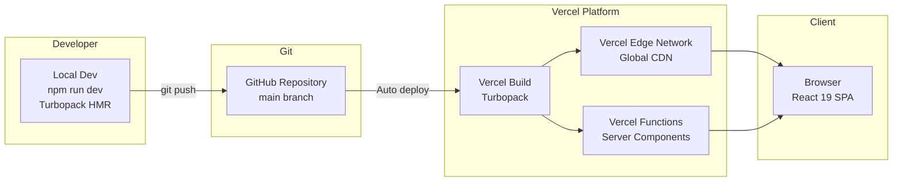
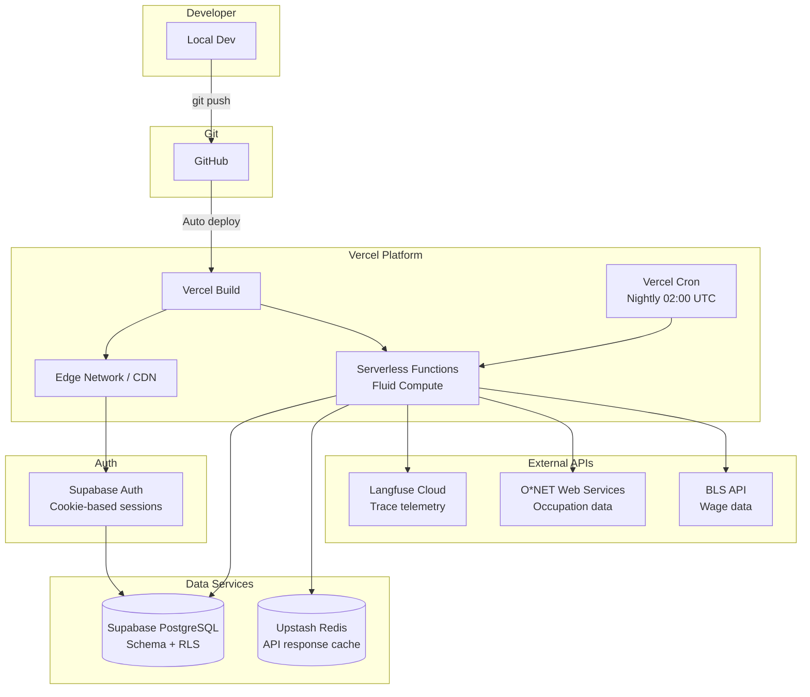
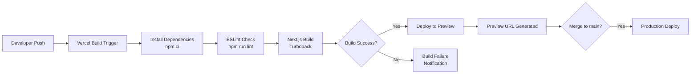

# 6. Deployment & Infrastructure

## Current Deployment

The application is deployed on **Vercel** (linked project exists in `.vercel/` directory).

### Deployment Configuration

| Setting | Value |
|---|---|
| **Platform** | Vercel |
| **Framework** | Next.js 16.2 (auto-detected) |
| **Build Command** | `npm run build` (default) |
| **Output Directory** | `.next` (default) |
| **Node.js Version** | 24 LTS (Vercel default) |
| **Bundler** | Turbopack (default in Next.js 16) |

### Build & Deploy Commands

```bash
# Local development
npm run dev          # Starts Turbopack dev server on localhost:3000

# Production build (local)
npm run build        # Creates optimized production build
npm run start        # Serves production build locally

# Deploy to Vercel
vercel               # Preview deployment
vercel --prod        # Production deployment
```

### Project Configuration (`next.config.ts`)

```typescript
import type { NextConfig } from 'next'
const nextConfig: NextConfig = {}
export default nextConfig
```

Currently empty — using all Next.js 16 defaults.

## Infrastructure Diagram (Current)



## Infrastructure Diagram (Target State)



## Environment Variables (Target)

| Variable | Scope | Purpose |
|---|---|---|
| `NEXT_PUBLIC_SUPABASE_URL` | Public | Supabase project URL |
| `NEXT_PUBLIC_SUPABASE_ANON_KEY` | Public | Supabase anon key (RLS enforced) |
| `SUPABASE_SERVICE_ROLE_KEY` | Server | Bypass RLS for cron snapshot writes |
| `LANGFUSE_PUBLIC_KEY` | Server | Langfuse project key |
| `LANGFUSE_SECRET_KEY` | Server | Langfuse secret (encrypted at rest) |
| `LANGFUSE_BASEURL` | Server | Default: `https://cloud.langfuse.com` |
| `ONET_USERNAME` | Server | O*NET Web Services account |
| `UPSTASH_REDIS_REST_URL` | Server | Redis cache endpoint |
| `UPSTASH_REDIS_REST_TOKEN` | Server | Redis auth token |
| `CRON_SECRET` | Server | Vercel cron job authentication |

## Scaling Strategy

| Concern | Strategy |
|---|---|
| **Static Assets** | Vercel Edge Network (global CDN) |
| **Server Components** | Vercel Serverless Functions with Fluid Compute |
| **Database** | Supabase managed PostgreSQL (auto-scaling) |
| **API Caching** | Upstash Redis (serverless, HTTP-based) |
| **O*NET Data** | 7-day revalidation cache + local DB table |
| **Langfuse Data** | 5-minute Redis TTL + nightly DB snapshots |

## CI/CD Pipeline



## File Structure for Deployment

```
.vercel/                  # Vercel project link config
.gitignore               # Excludes node_modules, .next, .env*.local
next.config.ts           # Next.js configuration (currently empty)
postcss.config.mjs       # PostCSS with @tailwindcss/postcss
tsconfig.json            # TypeScript config with @/* path alias
eslint.config.mjs        # ESLint flat config
package.json             # Dependencies and scripts
```
