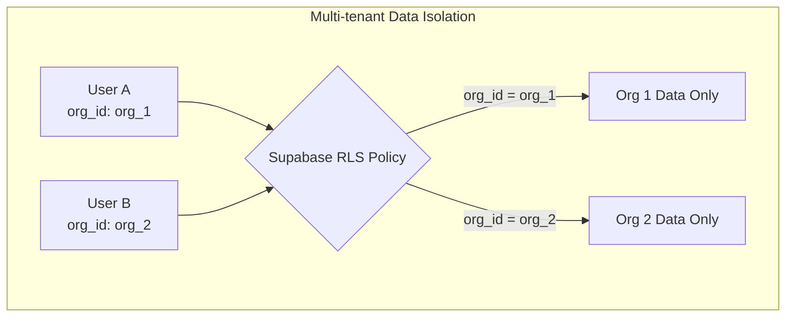

# 7. Security Considerations

## Current Security Posture

The application is currently a **frontend-only demo** with no authentication, no API endpoints, and no sensitive data processing. Security considerations below cover both the current state and the planned production architecture.

### Current Risks

| Risk | Severity | Status |
|---|---|---|
| `credentials.csv` in project root | **HIGH** | File exists at project root — must be added to `.gitignore` and removed from git history before any public repository access |
| No authentication | Medium | Acceptable for demo; required for production |
| Mock data only | Low | No real data exposure risk |
| Client-side rendering | Low | No server-side injection vectors |

### Immediate Action Required

**`credentials.csv`** — This file exists in the project root and appears to contain credentials. It should be:
1. Added to `.gitignore` immediately
2. Removed from git history using `git filter-branch` or `git filter-repo`
3. Never committed to any shared repository

## Planned Security Architecture

### Authentication & Authorization

| Layer | Technology | Implementation |
|---|---|---|
| **Authentication** | Supabase Auth | Cookie-based sessions via `@supabase/ssr` |
| **Authorization** | Supabase RLS | Row-level security on `org_id` column |
| **Role Management** | `users.role` column | 6 roles: executive, finance, quality, operations, ai_lead, compliance, admin |
| **Route Protection** | Next.js `proxy.ts` | Unauthenticated requests redirect to `/login` |
| **Role Checks** | Page-level | `users.role` checked in Server Components |

### Data Isolation

### API Security

| Endpoint | Auth Method | Notes |
|---|---|---|
| All Server Actions | Supabase session cookie | Validated via `@supabase/ssr` |
| `/api/cron/snapshots` | `CRON_SECRET` header | Vercel cron authentication |
| `/api/onet/search` | Session cookie | Server-side proxy to O*NET |
| `/api/langfuse/traces/*` | Session cookie | Redis-cached responses |
| `/api/audit/export` | Session cookie + role check | Compliance/admin only |

### Secrets Management

| Secret | Storage | Access |
|---|---|---|
| Supabase service role key | Vercel env vars | Server-side only, cron jobs |
| Langfuse keys | Supabase vault (encrypted) | Per-org, server-side only |
| O*NET credentials | `organisations` table | Per-org, server-side only |
| Redis tokens | Vercel env vars | Server-side only |
| `CRON_SECRET` | Vercel env vars | Server-side only |

### Audit Trail

The `audit_log` table is designed as an **append-only** store:
- No `UPDATE` or `DELETE` operations permitted (enforced via Supabase RLS policy)
- Every collaborative task decision is logged with:
  - Reviewer identity (`reviewer_user_id`)
  - Agent recommendation vs human decision
  - Decision type (approved/overridden/escalated)
  - Review duration
  - Immutable timestamp
- Designed for EU AI Act Article 14 compliance
- Exportable for external audit

### Compliance Targets

| Standard | Relevance | Implementation |
|---|---|---|
| **EU AI Act Article 14** | Human oversight of AI decisions | Audit log, override tracking, decision evidence |
| **ISO/IEC 42001:2023** | AI management system | Governance dashboard, compliance score |
| **SOC 2** | Data security | Supabase managed infrastructure |
| **GDPR** | Data protection | Per-org data isolation via RLS |

## Security Best Practices Checklist

- [ ] Remove `credentials.csv` from repository and git history
- [ ] Add `.env*.local` to `.gitignore`
- [ ] Implement Supabase Auth with `@supabase/ssr`
- [ ] Configure RLS policies on all tables
- [ ] Add `proxy.ts` for route protection
- [ ] Validate all Server Action inputs with Zod schemas
- [ ] Encrypt Langfuse keys at rest in Supabase vault
- [ ] Configure `CRON_SECRET` for cron endpoint authentication
- [ ] Set up Content Security Policy headers
- [ ] Enable Vercel Firewall (automatic DDoS protection)
- [ ] Audit `audit_log` table RLS to prevent UPDATE/DELETE
