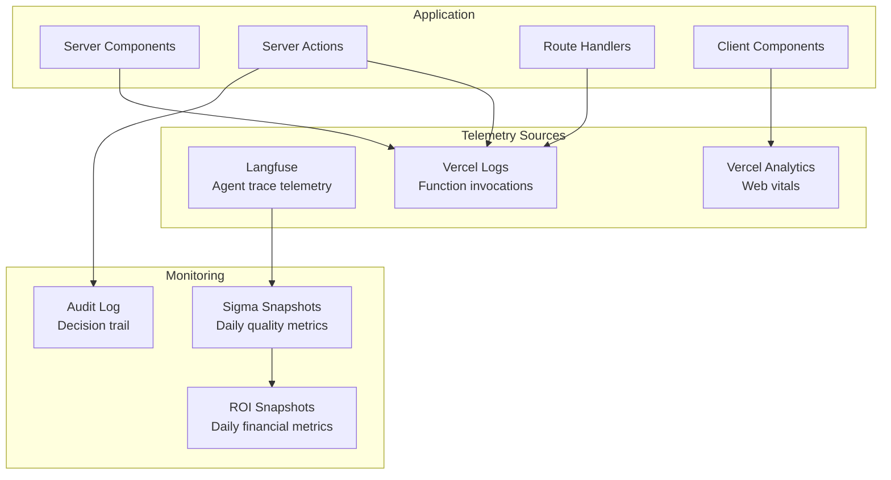

# 9. Observability & Debugging

## Current Observability

The application currently has **minimal observability** — it's a frontend demo with no backend logging, metrics, or tracing.

### What's Observable Now

| Layer | Observable? | How |
|---|---|---|
| **Client-side rendering** | Yes | Browser DevTools |
| **React component tree** | Yes | React DevTools |
| **Network requests** | Yes | Browser Network tab (currently none — all data is local) |
| **Build errors** | Yes | Turbopack console output |
| **ESLint issues** | Yes | `npm run lint` |
| **Deployment logs** | Yes | Vercel dashboard |

### Debugging the Mock Data

The mock data generator in `lib/mock-data.ts` uses deterministic seeding. To debug data generation:

```typescript
// The seed for any workflow is predictable:
const seed = workflowId.length * 137

// Each run's tier is determined by:
const s = (seed + runIndex * 31337) % 1000
// s < 720 = fast, s < 870 = slow, s >= 870 = failed
```

To test different data distributions, modify the thresholds in `generateRuns()`:
- Line 56: `s < 720` — controls fast run percentage
- Line 56: `s < 870` — controls slow vs failed boundary

### Debugging Verdict Logic

Verdict thresholds are in `lib/mock-data.ts` lines 119-121:

```typescript
if (slaHitRate >= 0.88 && successRate >= 0.82 && roiPositive) verdict = 'GREEN'
else if (slaHitRate >= 0.70 || successRate >= 0.65) verdict = 'AMBER'
else verdict = 'RED'
```

All 4 current workflows resolve to the same verdict due to the deterministic generator. To test different verdicts, modify the thresholds or the workflow `sla_ms` values.

## Target Observability Architecture

### Monitoring Stack (Planned)



### Key Metrics to Monitor

#### Agent Performance Metrics (from Langfuse)

| Metric | Source | Alert Threshold |
|---|---|---|
| Success rate | `outcome` field per run | < 65% (RED verdict) |
| P50 latency | Span timing | > 50% of SLA |
| P90 latency | Span timing | > SLA threshold |
| P95 latency | Span timing | > 150% of SLA |
| Cost per success | Token spend / successful runs | > 2x baseline |
| Sigma score | Computed from DPMO | < 3.0 (needs tuning) |
| OEE score | Availability x Performance x Quality | < 0.85 (below world-class) |

#### Platform Metrics (from Vercel)

| Metric | Source | Alert Threshold |
|---|---|---|
| Function cold starts | Vercel logs | > 5s |
| Function errors | Vercel logs | > 1% error rate |
| Build time | Vercel build logs | > 5 minutes |
| Edge latency | Vercel Analytics | > 500ms TTFB |

### Logging Strategy (Target)

```typescript
// Planned logging structure for Server Actions
const log = {
  level: 'info',
  action: 'computeSigmaSnapshot',
  org_id: 'uuid',
  agent_name: 'OddsScraperAgent',
  metrics: {
    dpmo: 6210,
    sigma: 4.0,
    oee: 0.81,
    total_invocations: 200
  },
  duration_ms: 1234,
  timestamp: new Date().toISOString()
}
```

### Error Handling Patterns

| Error Type | Handling | User Impact |
|---|---|---|
| Langfuse API timeout | Redis cache fallback (stale data) | Shows cached data with "last updated" indicator |
| O*NET API unavailable | Local `onet_tasks` table fallback | No impact (7-day cache) |
| Supabase connection error | Server error page | Full page error with retry |
| Invalid cron request | 401 Unauthorized | No user impact |
| Redis cache miss | Fresh Langfuse fetch | Slightly slower response |

### Performance Profiling

#### Current Performance Characteristics

| Operation | Time | Notes |
|---|---|---|
| `generateRuns(workflowId, 50)` | < 1ms | Pure computation, no I/O |
| `computeSummary(workflowId)` | < 1ms | Calls generateRuns internally |
| Dashboard full render | ~200-400ms | Client-side, depends on Recharts |
| Recharts initial render | ~100-200ms | Chart library initialization |

#### Performance Concerns

1. **Recharts bundle size**: ~200KB gzipped. Consider lazy loading charts or switching to a lighter charting library if bundle size becomes an issue
2. **Dashboard re-renders**: Entire dashboard re-renders on workflow change due to `useState` at page level. Consider `useMemo` for expensive computations
3. **RecentRuns table**: Renders all 50 runs. Consider virtualization if run count increases significantly
