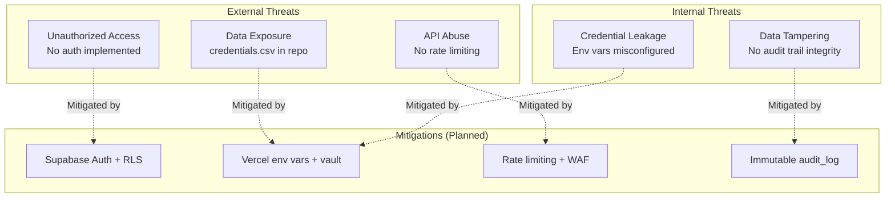

# 13. Security Audit & Compliance Review

## Security Audit Summary

### Audit Scope
- All source files in the repository (excluding `node_modules/`)
- Configuration files (`.gitignore`, `tsconfig.json`, `next.config.ts`, `eslint.config.mjs`)
- Dependency analysis (`package.json`, `package-lock.json`)

### Critical Findings

| # | Finding | Severity | OWASP Category | Status |
|---|---|---|---|---|
| SA-001 | `credentials.csv` committed to repository | **CRITICAL** | A07:2021 - Security Misconfiguration | OPEN |
| SA-002 | No authentication implemented | HIGH | A07:2021 - Security Misconfiguration | Expected (demo phase) |
| SA-003 | No input validation | MEDIUM | A03:2021 - Injection | Expected (no inputs yet) |
| SA-004 | No Content Security Policy headers | LOW | A05:2021 - Security Misconfiguration | Expected (demo phase) |

### SA-001: Credentials File in Repository

**Finding**: A file named `credentials.csv` (4,523 bytes) exists at the project root and is tracked by git.

**Risk**: If this repository is shared publicly or with unauthorized parties, credentials will be exposed. Even in a private repository, credential files should not be version-controlled.

**Remediation Steps**:
1. Determine what credentials the file contains
2. Rotate all credentials found in the file
3. Remove from git history:
   ```bash
   git filter-repo --path credentials.csv --invert-paths
   ```
4. Add to `.gitignore`:
   ```
   credentials.csv
   *.csv
   ```
5. Store credentials in a secure vault (e.g., Vercel environment variables, Supabase vault)

### SA-002: No Authentication

**Finding**: No authentication mechanism is implemented. All pages are publicly accessible.

**Current Risk**: LOW (demo with mock data only)
**Future Risk**: CRITICAL (when real telemetry data is connected)

**Remediation Plan** (from tech spec):
- Supabase Auth with `@supabase/ssr` for cookie-based sessions
- `proxy.ts` middleware for route protection
- Role-based access via `users.role` column
- Supabase Row-Level Security for data isolation

### SA-003: No Input Validation

**Finding**: No form inputs, API endpoints, or Server Actions exist in the current codebase. No validation is needed yet.

**Future Risk**: HIGH (when Server Actions are added)

**Remediation Plan**:
- All Server Action inputs validated with Zod schemas
- All route handler parameters sanitized
- O*NET API proxy should sanitize search queries

## Compliance Requirements

### EU AI Act (Article 14) — Human Oversight

| Requirement | Implementation | Status |
|---|---|---|
| Human oversight of high-risk AI decisions | `audit_log` table with decision tracking | PLANNED |
| Record of human reviewer identity | `reviewer_user_id` FK to users | PLANNED |
| Evidence of agent recommendation vs human decision | `agent_recommendation` + `human_decision` columns | PLANNED |
| Override tracking | `decision_type` enum (approved/overridden/escalated) | PLANNED |
| Decision timing | `review_duration_seconds` field | PLANNED |
| Immutable audit trail | RLS policy preventing UPDATE/DELETE | PLANNED |
| Exportable evidence | PDF export via `/api/audit/export` | PLANNED |

### ISO/IEC 42001:2023 — AI Management System

| Requirement | Implementation | Status |
|---|---|---|
| AI system inventory | Process + agent configuration in DB | PLANNED |
| Risk assessment | FMEA risk board (Screen D3) | Phase 2 |
| Performance monitoring | Sigma scorecards, OEE metrics | April 7 |
| Governance procedures | Audit log, compliance score | April 7 (static) |
| Quality benchmarks | Configurable sigma targets per org | PLANNED |
| Documentation | This technical documentation set | IN PROGRESS |

## Security Best Practices Assessment

### Implemented

| Practice | Status |
|---|---|
| TypeScript strict typing | Partial — types defined but `!` assertions used |
| ESLint code quality | Configured with Next.js presets |
| `package-lock.json` for deterministic installs | Present |
| No inline `<script>` tags | Confirmed |
| No `dangerouslySetInnerHTML` usage | Confirmed |
| No `eval()` or dynamic code execution | Confirmed |

### Not Implemented (Required for Production)

| Practice | Priority |
|---|---|
| Authentication and session management | P0 |
| Input validation (Zod schemas) | P0 |
| Content Security Policy headers | P1 |
| CORS configuration | P1 |
| Rate limiting on API endpoints | P1 |
| Secrets management (no hardcoded secrets) | P0 |
| HTTPS enforcement | Automatic on Vercel |
| Cookie security flags (HttpOnly, Secure, SameSite) | P1 |
| SQL injection prevention | P0 (via Supabase parameterized queries) |
| XSS prevention | P1 (React handles by default) |

## Threat Model


