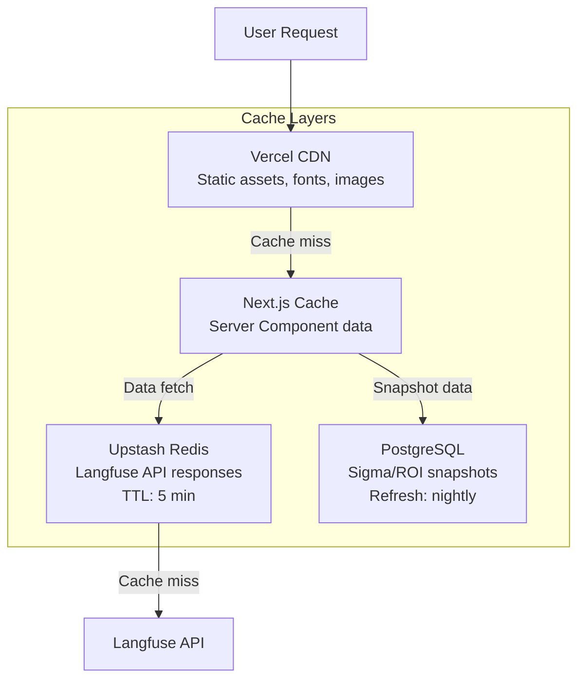

# 14. Performance Analysis & Optimization Strategy

## Current Performance Profile

### Bundle Analysis

| Component | Estimated Size (gzipped) | Impact |
|---|---|---|
| React 19 + React DOM | ~45 KB | Core runtime |
| Next.js App Router runtime | ~85 KB | Framework |
| Recharts | ~200 KB | Largest dependency |
| Lucide React (tree-shaken) | ~5-10 KB | Only imported icons |
| Sonner | ~8 KB | Toast library |
| clsx | ~1 KB | Utility |
| Application code | ~15-20 KB | Components + logic |
| **Total estimated** | **~360-370 KB** | |

### Rendering Performance

| Page | Render Type | Estimated FCP | Notes |
|---|---|---|---|
| `/` | Server redirect | < 50ms | `redirect('/dashboard')` — no render |
| `/dashboard` | Client-side | ~300-500ms | Full chart suite, 7 widget components |
| `/workflows` | Client-side | ~200-300ms | 4 workflow cards with sparklines |
| `/workflows/[id]` | Client-side | ~250-400ms | Trace viewer with span bars |
| `/compare` | Client-side | ~300-500ms | Comparison matrix with computed data |
| `/reports` | Client-side | ~150-250ms | Simpler layout |
| `/settings` | Client-side | ~100-200ms | Form-based, minimal computation |

### Data Computation Performance

| Operation | Time | Complexity | Notes |
|---|---|---|---|
| `generateRuns(id, 50)` | < 0.5ms | O(n) | 50 runs, pure math |
| `computeSummary(id)` | < 1ms | O(n) | Sorts + aggregates 50 runs |
| `generateSparkline(id, 7)` | < 0.1ms | O(n) | 7 data points |
| Full dashboard data prep | < 2ms | O(n) | All three functions combined |

## Performance Bottlenecks

### 1. Recharts Bundle Size (~200 KB gzipped)
- **Impact**: Adds significant weight to initial page load
- **Mitigation Options**:
  - Lazy load chart components with `next/dynamic`
  - Consider lighter alternatives: `chart.js` (~70KB), `visx` (modular), or `uPlot` (~35KB)
  - Route-level code splitting already handled by Next.js App Router

### 2. Client-Side Data Generation on Every Render
- **Impact**: `computeSummary` and `generateRuns` execute on every render of the dashboard
- **Current Cost**: < 2ms (negligible)
- **Future Risk**: When replaced with real API calls, this becomes a network latency issue
- **Mitigation**:
  ```typescript
  const summary = useMemo(() => computeSummary(activeWorkflowId), [activeWorkflowId])
  const runs = useMemo(() => generateRuns(activeWorkflowId), [activeWorkflowId])
  ```

### 3. Full Page Re-render on Workflow Change
- **Impact**: Changing the workflow selector triggers a re-render of the entire dashboard including all 7 chart components
- **Mitigation**: Already partially addressed with `key` props forcing clean re-mount (better than diffing complex chart states)

### 4. No Image Optimization
- **Current State**: Only SVG icons from Lucide and static SVGs in `/public/`
- **No `next/image` usage** — acceptable since there are no raster images currently

## Optimization Recommendations

### Immediate (Low Effort, High Impact)

#### 1. Memoize Data Computations
```typescript
// In dashboard/page.tsx
const summary = useMemo(() => computeSummary(activeWorkflowId), [activeWorkflowId])
const runs = useMemo(() => generateRuns(activeWorkflowId), [activeWorkflowId])
```
**Effort**: 5 minutes | **Impact**: Eliminates redundant computation

#### 2. Lazy Load Chart Components
```typescript
import dynamic from 'next/dynamic'

const LatencyChart = dynamic(() => import('@/components/dashboard/LatencyChart')
  .then(mod => ({ default: mod.LatencyChart })), {
  loading: () => <div className="card h-[300px] animate-pulse" />,
  ssr: false
})
```
**Effort**: 30 minutes | **Impact**: Reduces initial JS bundle, defers Recharts loading

### Medium Term (When Moving to Real Data)

#### 3. Server Component Migration
Move data fetching to Server Components to eliminate client-side waterfalls:

```
Current:  Browser → Client Component → computeSummary() (sync)
Target:   Browser → Server Component → Supabase query → Stream to client
```

**Impact**: Faster perceived load (streaming), smaller client bundle, better SEO

#### 4. Redis Caching for Langfuse API
Per the tech spec, Langfuse responses should be cached in Upstash Redis with 5-minute TTL:
- Cache key: `langfuse:{org_id}:{agent_name}:{date_range}:{metric_type}`
- Eliminates repeated API calls for the same data

#### 5. Nightly Snapshot Precomputation
Sigma scores and ROI metrics are computed nightly via Vercel Cron and stored in PostgreSQL. This means chart data reads from fast DB queries, not slow Langfuse API aggregations.

### Long Term

#### 6. Streaming and Suspense Boundaries
```tsx
// Wrap each dashboard section in Suspense
<Suspense fallback={<StatBannerSkeleton />}>
  <StatBanner workflowId={activeWorkflowId} />
</Suspense>
```

#### 7. Consider Chart Library Alternatives
If bundle size becomes critical:

| Library | Size (gzipped) | Trade-off |
|---|---|---|
| Recharts (current) | ~200 KB | Full-featured, React-native |
| Chart.js + react-chartjs-2 | ~70 KB | Good, less React-native |
| visx | ~30-50 KB (modular) | Low-level, more code |
| uPlot | ~35 KB | Fastest, least React-friendly |

## Core Web Vitals Targets

| Metric | Target | Current (Estimated) | Notes |
|---|---|---|---|
| **LCP** (Largest Contentful Paint) | < 2.5s | ~1.5-2.0s | VerdictCard is likely LCP element |
| **INP** (Interaction to Next Paint) | < 200ms | ~50-100ms | Workflow selector is main interaction |
| **CLS** (Cumulative Layout Shift) | < 0.1 | ~0 | Fixed layout, no dynamic content shifts |
| **FCP** (First Contentful Paint) | < 1.8s | ~0.8-1.2s | Client-side render after JS load |
| **TTFB** (Time to First Byte) | < 800ms | ~100-200ms | Vercel Edge Network |

## Caching Strategy (Target)


