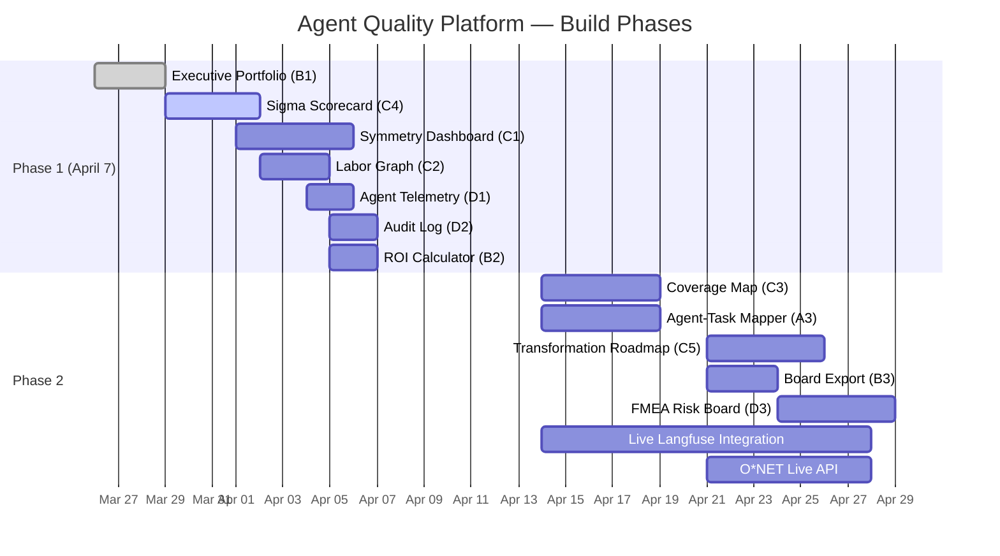
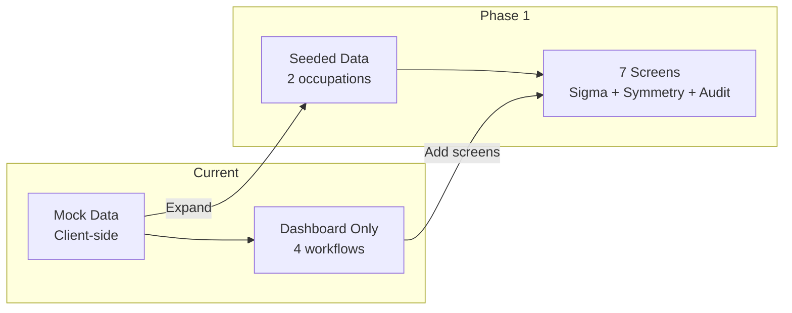
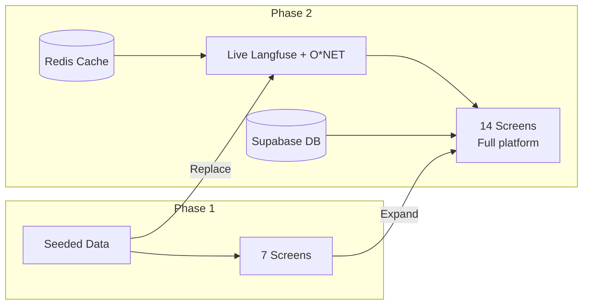

# 15. Migration & Future Roadmap

## Phase Overview

## April 7 Demo Scope (Phase 1)

### Screens to Build

| Priority | Screen | Route | Est. Hours | Description |
|---|---|---|---|---|
| 1 | Executive Portfolio | `/dashboard` | 3h | Traffic light cards, headline ROI number |
| 2 | Sigma Scorecard | `/process/[id]/sigma` | 4h | Per-agent sigma scores, DPMO, trend lines |
| 3 | Symmetry Dashboard | `/process/[id]` | 5h | Hero screen — agent + human + equation |
| 4 | Labor Graph | `/process/[id]/labor` | 3h | Before/after task ownership |
| 5 | Agent Telemetry | `/agents/[id]` | 2h | Integrate existing telemetry views |
| 6 | Audit Log | `/governance/audit` | 2h | Static audit table with export |
| 7 | ROI Calculator | `/dashboard/roi` | 2h | Waterfall chart, cost slider |
| **Total** | | | **21h** | |

### Seeded Data Strategy

Two occupations for the demo:
1. **Sports Betting Analyst** (O*NET: 13-2099.01) — 3 agents, directly relevant to VIPPlay
2. **Customer Service Representative** (O*NET: 43-4051.00) — 2 agents, universally understood

Sigma scores should tell a story: one agent at 4.2σ trending up (GREEN), one at 2.9σ (AMBER attention flag).

### Route Migration Plan

The current route structure needs to evolve to match the tech spec:

| Current Route | Target Route | Change |
|---|---|---|
| `/dashboard` | `/dashboard` | Evolve to executive portfolio (B1) |
| `/workflows` | Keep or merge into `/process` | May rename |
| `/workflows/[id]` | `/process/[id]` | Rename to process-centric |
| `/compare` | Keep | Add sigma comparison |
| `/reports` | `/dashboard/export` | Merge into executive group |
| `/settings` | `/setup/org` | Split into 3 setup screens |
| — | `/process/[id]/sigma` | NEW — Sigma scorecard (C4) |
| — | `/process/[id]/labor` | NEW — Labor graph (C2) |
| — | `/process/[id]/coverage` | NEW — Coverage map (C3, Phase 2) |
| — | `/process/[id]/roadmap` | NEW — Roadmap (C5, Phase 2) |
| — | `/agents/[id]` | NEW — Agent telemetry (D1) |
| — | `/governance/audit` | NEW — Audit log (D2) |
| — | `/governance/fmea` | NEW — FMEA board (D3, Phase 2) |
| — | `/setup/occupation` | NEW — O*NET selector (A2) |
| — | `/setup/mapping` | NEW — Agent-task mapper (A3, Phase 2) |
| — | `/dashboard/roi` | NEW — ROI calculator (B2) |

## Phase 2 Features

### Live Langfuse Integration
- Replace mock data with Langfuse Node SDK (`langfuse ^3.x`)
- Redis cache layer (Upstash, 5-minute TTL)
- Nightly cron job for sigma/ROI snapshot computation
- Gateway proxy for real-time trace streaming

### O*NET Live API Integration
- Register O*NET Web Services account
- Occupation search endpoint (`/api/onet/search`)
- Task list caching (7-day revalidation)
- Full task drill-down with automation susceptibility scores

### Additional Screens
- Coverage Map (C3) — Color-coded task ownership with Langfuse drill-down
- Agent-Task Mapper (A3) — Drag-and-drop interface
- Transformation Roadmap (C5) — Maturity stage progression
- Board Export (B3) — PDF/PPTX generation
- FMEA Risk Board (D3) — Severity x Occurrence x Detection heatmap

### Infrastructure Additions
- Supabase PostgreSQL with full schema (3 domains, 8 tables)
- Supabase Auth with cookie-based sessions
- Upstash Redis for API response caching
- Vercel Cron for nightly computations
- Role-based access control (6 roles)

## Architecture Evolution

### Current → Phase 1

### Phase 1 → Phase 2

## Open Decisions

| # | Decision | Options | Recommendation | Status |
|---|---|---|---|---|
| 1 | PDF export library | react-pdf vs Puppeteer | react-pdf (Vercel compatible) | PENDING |
| 2 | O*NET for April 7 | Live API vs seeded data | Seed 2 occupations | RECOMMENDED |
| 3 | Multi-tenant vs single-org | Full RLS vs single org | Build RLS from day one | RECOMMENDED |
| 4 | Real-time vs snapshot | Live streaming vs nightly | Snapshots for charts, live for D1 only | RECOMMENDED |
| 5 | SERVQUAL implementation | Full 5-dimension vs simplified | Simplified: OEE calc, SERVQUAL labels | RECOMMENDED |
| 6 | Chart library | Keep Recharts vs alternatives | Keep Recharts (adequate, known) | RECOMMENDED |
| 7 | Drag-and-drop library | react-beautiful-dnd vs @dnd-kit | @dnd-kit (actively maintained) | RECOMMENDED |

## Risk Register

| Risk | Likelihood | Impact | Mitigation |
|---|---|---|---|
| Langfuse API rate limits | Medium | High | Redis cache + nightly snapshots |
| O*NET account registration delay | Low | Medium | Seed data for April 7 demo |
| Recharts bundle size issues | Low | Medium | Lazy loading, code splitting |
| Multi-tenant data leakage | Low | Critical | Supabase RLS from day one |
| April 7 deadline pressure | Medium | High | Prioritized build order, seeded data |
| EU AI Act compliance gaps | Medium | High | Immutable audit_log, decision evidence |
